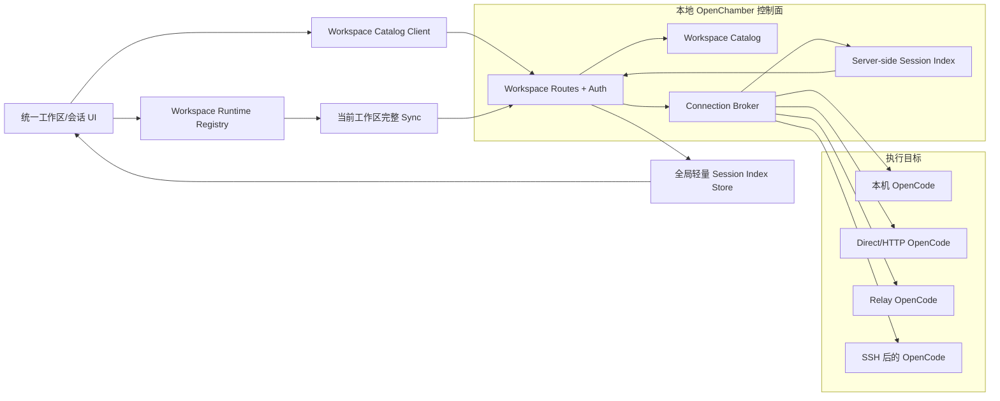

# 统一工作区与会话架构（交付状态）

> 状态：已交付（代码与测试全部落地，2026-08-11 收敛本文件）
> 基线日期：2026-08-10
> 适用范围：`packages/ui`、`packages/web`、`packages/electron`、`packages/vscode`、`packages/mobile`
> 核心目标：以一个本地 OpenChamber 控制面统一管理所有服务器上的工作区与会话；用户不再通过切换服务器来切换会话。
>
> 本文件已移除全部已完成部分的执行指令（分阶段清单、逐模块实现要求、迁移细节等），保留：产品契约、持续生效的架构不变量、已交付模块索引、功能开关与诊断语义、剩余退出门禁与 Definition of Done 状态。实现细节以代码和 `packages/**/DOCUMENTATION.md` 为权威。

## 1. 一句话架构与核心结论

> `本地统一目录 -> 工作区(connectionId + path) -> 会话(workspaceId + upstreamSessionId) -> 工作区绑定运行时句柄 -> 服务器侧连接代理`

以下 8 条决策结论全部达成，是产品契约，不得回归：

1. 侧边栏只展示统一的工作区与会话树，不再展示独立的本地项目区、远程 Fleet 区或服务器卡片。
2. "添加工作区"是统一流程：选择服务器，选择或填写该服务器上的路径，然后保存；当前电脑只是默认服务器。
3. 工作区和会话的主模型中不存在 `isLocal`、`isRemote` 或 `projectType` 分支。连接类型只存在于传输层内部。
4. 本地与远程可以使用辅助色、状态点或服务器名称作为次要信息，但不得改变排序、层级、可用操作或导航模型。
5. 打开任意会话只改变当前 `workspaceId`、`sessionId` 和绑定的运行时句柄，不得调用全局 `switchRuntimeEndpoint()`，也不得清空其他工作区的目录或摘要。
6. 浏览器始终连接当前 OpenChamber 控制面。远端认证、SSH、Relay 和上游 URL 由控制面解析，远端令牌不得进入渲染器。
7. 全局侧边栏维护轻量会话索引；完整消息、文件、Git、终端和权限状态只为当前工作区按需加载。
8. 连接失败必须保留上一次成功快照并标记为过期或不可达，不能表现为"没有会话"。

## 2. 术语

| 术语 | 定义 | 用户是否直接感知 |
|---|---|---|
| 控制面（Control Plane） | 当前客户端连接的 OpenChamber 服务，持有统一目录、公开连接元数据和路由能力 | 是，表现为当前 OpenChamber 实例 |
| 连接档案（Connection Profile） | 一个逻辑服务器及其访问方式；凭据只在服务端或 Electron main 中解析 | 仅在设置和添加工作区时感知 |
| 工作区（Workspace） | 稳定 UUID 标识的目录项，由 `connectionId + canonicalPath` 定位 | 是，侧边栏一等实体 |
| 会话引用（Session Ref） | 工作区内一个 OpenCode 会话的轻量引用 | 是，工作区下的一等实体 |
| 工作区范围键（Workspace Scope Key） | 所有客户端缓存、同步和持久化的隔离键，首选稳定 `workspaceId` | 否 |
| 工作区运行时句柄（Workspace Runtime Handle） | 绑定到某一工作区的 SDK、RuntimeAPIs、URL 解析和生命周期对象 | 否 |
| 会话索引（Session Index） | 控制面维护的跨连接轻量会话摘要，不包含消息正文 | 仅通过侧边栏结果感知 |

代码审查时必须区分两种"本地"：

- **本地目录权威**：所有工作区记录都由当前控制面统一管理。这是本方案要求的"只保留本地"。
- **本机执行目标**：工作区实际位于当前机器。这只是连接档案的一种内部传输实现，不是产品实体类型。

## 3. 目标架构（已落地）

## 4. 已交付模块索引

### 4.1 服务端 `packages/web/server/lib/workspaces/`

| 模块 | 职责 | 权威文档/测试 |
|---|---|---|
| `catalog-schema.js` / `catalog-store.js` | 运行时校验、revision、原子写、备份、串行 mutation 队列、409 冲突 | `DOCUMENTATION.md` + `catalog-store.test.js`（含损坏恢复、schema 99/0 写拒绝） |
| `workspace-identity.js` | UUID、`(connectionId, canonicalPath)` 唯一键、session key、路径比较 | `workspace-identity.test.js` |
| `connection-profile-store.js` | 私有 target/credential provider、公开 DTO serializer（脱敏） | `connection-profile-store.test.js` |
| `session-binding-store.js` | 会话归属绑定（created/explicit/legacy-exact-path），独立 revision，离线不清理 | `session-binding-store.test.js` |
| `connection-broker.js` | adapter registry、lease、probe、fetch/SSE/WS、idle grace、dispose（含 lease 存活时关闭隧道） | `connection-broker.test.js` |
| `local-adapter.js` / `direct-adapter.js` / `relay-adapter.js` | 三种传输 adapter；relay 由 `../relay/tunnel-client.js`（服务端发起方，与 UI 客户端字节兼容）承载 | 各自 test + `relay-adapter.test.js`（URL token、lease、隔离、退避） |
| `session-index.js` / `session-index-routes.js` | 每连接单事件流、snapshot/增量事件、per-connection freshness、revision 协调；`sessionsByUpstreamId` 活动索引（事件 O(1)）；`refreshAll` worker 池（默认并发 4）+ 确定性 jitter | `session-index.test.js` + 性能预算证据（§8） |
| `runtime-proxy.js` | workspace 前缀 HTTP/SSE/WS 代理、method/path allowlist、响应脱敏、代理计数 | `runtime-proxy.test.js` + `runtime-ws.test.js`（真实 WS upgrade） |
| `migration.js` | legacy projects/Fleet 导入，幂等、断点续跑、不可达连接入 `pendingConnectionIds` | `migration.test.js` + `phase6-rehearsal.test.js` |
| `path-boundary.js` | adapter canonical path 边界校验 | `path-boundary.test.js` |
| `routes.js` | Catalog/session index/probe/runtime proxy 显式路由（generic proxy 之前） | `routes.test.js`、`connection-routes.test.js` |
| `diagnostics.js` | 脱敏诊断快照（§6） | `routes.test.js`（无秘密字段断言） |
| `index.js` | 组装 broker/catalog/index/migration；能力标志与 501 门禁（§5） | `connection-routes.test.js` |

### 4.2 共享 UI `packages/ui/src/workspaces/`

| 模块 | 职责 | 权威文档/测试 |
|---|---|---|
| `types.ts` / `identity.ts` | 公开类型契约、workspace/session scope key 唯一实现 | `identity.test.ts` |
| `catalog-client.ts` / `catalog-store.ts` | Catalog CRUD、revision 冲突、snapshot 重验、乐观 mutation 与权威回滚 | `catalog-client.test.ts`、`catalog-store.test.ts` |
| `session-index-client.ts` / `session-index-store.ts` | snapshot + SSE、revision 缺口恢复；`sessionIndex`（key→位置）Map，`applyEvent` O(1)，无 `findIndex`/`filter` 扫描 | `session-index-client.test.ts`、`session-index-store.test.ts` |
| `control-plane-fetch.ts` | 控制面固定 fetch（relay 模式走 runtimeFetch；无 window 时透传相对路径；能力不可用显式应答） | `control-plane-fetch.test.ts` |
| `workspace-runtime-fetch.ts` / `workspace-runtime-registry.ts` / `workspace-runtime-context.ts` / `WorkspaceRuntimeProvider.tsx` | workspace 前缀路径改写、SDK/RuntimeAPIs/URL resolver 句柄、`MAX_RETAINED_HANDLES=8` + 5s 零 lease 驱逐（可注入）、当前工作区完整 Sync 挂载 | `workspace-runtime-registry.test.ts`、`workspace-runtime-terminal.test.ts` |
| `AddWorkspaceDialog.tsx` | 统一"服务器 + 路径"创建流程，失败保留输入、重试靠唯一约束幂等 | — |
| `useActiveWorkspace.ts` | 当前工作区状态 | `useActiveWorkspace.test.ts` |
| `DOCUMENTATION.md` | UI ownership、identity、缓存、导航不变量、facade 活调用点清单 | — |

### 4.3 Electron 与其余运行时

- `packages/electron/workspace-connection-adapter.mjs`：ssh-manager → `startWebUiServer` 窄适配器（+`workspace-connection-adapter.test.mjs`）；`ssh-manager.mjs` 按 `sshInstanceId` 提供 lease/probe/forward/dispose。
- Mini Chat、托盘、通知、窗口标题、deep links 已全部迁移为 `WorkspaceSessionTarget { workspaceId, sessionId }`，无环境级"最近活跃服务器"继承（`ElectronMiniChatApp`、`tray.mjs`、`useTraySync`、`notification-store`、`useWindowTitle`、`deepLinks`）。
- VS Code / Mobile：消费同一 Catalog 类型与 workspace 前缀；不支持的能力经 `ConnectionCapabilities` 显式表达。

### 4.4 已删除的旧架构

- `packages/ui/src/fleet/`（fleet-store 的 `activeServerId`/activate、fleet-navigation、FleetSummaryBridge 分区角色）、`FleetSidebarSection.tsx` 及其渲染入口。
- 会话导航中的全局 runtime switch 路径（`workspaceSessionOpen.ts` 明确永不调用 `switchRuntimeEndpoint`）。
- 审计确认：`runtimeEndpointReset.ts` 两个触发点均为真实控制面切换（Host Switcher / relay restore / 移动端连接断开），**不存在**仅为普通会话切换保留的清空逻辑。
- `runtime-switch.ts` 死导出 `getActiveRelayTunnel` 已删除；其余导出因发布周期门禁保留（见 §7.1），活调用点清单见 `packages/ui/src/workspaces/DOCUMENTATION.md`。

## 5. 功能开关与诊断（§20/§19 交付）

### 5.1 服务端能力 `workspaceCatalogV1`

- 操作开关：环境变量 `OPENCHAMBER_WORKSPACE_CATALOG_DISABLED=1`（其他取值/缺省 = 启用）。
- 门禁范围：Catalog/连接 mutation（`POST /api/workspaces`、`PATCH/DELETE /api/workspaces/:id`、`POST/PATCH/DELETE /api/connections`）、session-index mutation、整个 workspace 运行时代理前缀、WS upgrade → `501 capability_unavailable`，注册在真实路由与 generic proxy 之前。
- 读接口保持可用：snapshot、browse、probe、`GET /api/workspaces/capabilities`（返回 `{ workspaceCatalogV1 }`）、session-index snapshot/SSE、diagnostics。
- **数据保全**：禁用只做读门禁，绝不删除或改写 catalog 数据文件。
- 客户端 UI 标志 `unifiedWorkspaceSidebarV1` 派生自该能力（未知 = 启用；仅权威 `false` 降级，失败保留上次值）；降级渲染 `WorkspaceCatalogDegradedSection`（警示横幅 + 只读工作区列表，无 mutation 入口）。服务端始终是强制点。
- 偏差记录：§20.3 的"关闭统一侧边栏后恢复旧导航"不可执行——Fleet 时代旧导航已删除；按"可见降级 + 禁 mutation + 数据保全"实现。

### 5.2 诊断快照 `GET /api/workspaces/diagnostics`

字段：`catalog {schemaVersion, revision, lastPersistSucceededAt, recoveryState, counts}`、`sessionIndex {revision, lastEventRevision, reloadCount, gapCount, per-connection {freshness, backoff, reloadCount, gapCount}}`、`connections {state, leaseCount, lastReleasedAt}`、`proxy {requests, failures, cancels, activeStreams, streamsServed}`、`migration {legacyProjectsImported, pendingCount, revision}`、`capabilities {workspaceCatalogV1}`。

脱敏规则：migration pending 路径只留计数；已知敏感键（`baseUrl`、`clientToken`、`credentialRef`、`sshInstanceId`、`allowRedirectHosts`、`token`、`authorization`、`headers`、`url`、`path`、`directory`）递归删除；路由测试断言序列化载荷无秘密字段。

## 6. 架构不变量（持续生效，不得回归）

### 6.1 身份与导航

1. `workspaceId` 是创建后不变的随机 UUID，不从路径、URL 或服务器名称计算。
2. 工作区唯一约束是 `(connectionId, canonicalPath)`；规范化必须在目标服务器语义下完成。
3. 全局会话键是 `(workspaceId, upstreamSessionId)`，不得只使用上游 session ID。
4. 任意组件不得通过读取 `window.location`、当前 API Base URL 或全局 runtime key 猜测工作区归属。
5. 点击会话只调用 `selectWorkspaceSession({ workspaceId, sessionId })`；导航路径内禁止调用 `switchRuntimeEndpoint()`。
6. 连接状态是工作区的附属状态，不是工作区存在性的来源。服务器离线时工作区仍必须留在目录中。

### 6.2 数据正确性

1. 权威请求失败不得写入空数组来替换旧数据。
2. 每个连接和工作区分别携带 `complete`、`stale`、`lastSuccessAt` 和 `error`；一个连接失败不得阻断其他连接。
3. SSE/WS 增量只能覆盖早于自身 revision 的快照；晚到快照不得回滚新状态。
4. 删除工作区只删除目录引用和本地 UI 缓存，不删除远程目录、文件、会话或终端。
5. 删除仍被工作区引用的连接必须被阻止，或者要求显式迁移/删除引用后再执行。
6. 历史会话只在目录完全相等或存在显式绑定时自动归属；重叠路径不得用最长前缀静默猜测。

### 6.3 安全边界

1. 渲染器只能看到公开连接摘要；令牌、自定义认证头、Relay 凭据和 SSH 私钥不得出现在 API 响应、URL、日志或 Local Storage 中。
2. `workspaceId` 必须在服务端解析为已保存的连接和路径；客户端不得传入任意 upstream URL。
3. 工作区代理必须使用允许的方法和路径集合，不能成为任意网络代理。
4. 路径浏览、文件、终端、Git 和权限/问题响应必须同时校验工作区和目录边界。
5. Electron 原生能力继续由 main process 持有；远程内容或普通渲染器不得直接调用全局 IPC。
6. 所有新增 HTTP、SSE 和 WebSocket 路径必须同步更新 UI auth、URL token、Relay host allowlist 和相应安全测试。

### 6.4 性能与生命周期

1. 空闲时不得按工作区轮询；同一连接最多维持一个全局事件流。
2. 侧边栏事件更新必须只修改受影响的连接、工作区和会话，不能每个事件扫描全部服务器和会话。
3. 完整消息与文件状态只为当前工作区加载；后台只保留有上限的会话摘要。
4. 每个连接代理、事件流、Relay tunnel、SSH tunnel 和 WorkspaceRuntimeHandle 都必须有明确 owner、ref count/lease 和 `dispose()`。
5. EOF、认证失败和网络错误都必须进入断开状态并退避，不能形成零延迟重连循环。

## 7. 剩余退出门禁（未完成部分）

### 7.1 发布周期门禁（§12.4/§9.4，需 ≥1 个兼容发布周期 + VS Code 依赖落地）

1. `packages/ui/src/lib/projectId.ts` 最终删除——当前仍是 `openchamberConfig.ts`（legacy 迁移）、`persistence.ts`（兼容读）、`useProjectsStore.ts`（VS Code folder bridge）的合法兼容路径。
2. `useProjectsStore` legacy 双读路径（`legacyProjectMetadataByPath`、`legacyKey`）移除——等 Catalog 完全取代；VS Code folder bridge 需稳定 VS Code workspace descriptor。
3. `runtime-switch.ts` 核心导出（`getRuntimeKey`/`getRuntimeApiBaseUrl`/`switchRuntimeEndpoint`/`subscribeRuntimeEndpoint*`）删除——依赖 1+2 与 7.3-1；`sync-context` 的 `getRuntimeKey()` fallback 同步移除（`VSCodeApp` 无 workspace handle，需先落地 VS Code 控制面代理）。
4. `runtimeEndpointReset.ts` 整模块删除——依赖 7.3-1。
5. `useGlobalSessionsStore` 退役（含 test-only `resetForRuntimeSwitch`）——被 Session Index + workspace-bound 消费者取代。
6. 旧 Fleet/projects 分片数据删除——独立、延后、可审计的版本步骤，不与任何迁移同事务。

### 7.2 环境与真实验收门禁

1. **生产构建阻塞**：环境缺 `@capacitor/app`、`@capacitor/push-notifications`、`@capacitor/keyboard`、`fflate` 安装；`MessageList.tsx` 与 tanstack/react-virtual 版本漂移；`client.ts` 的 `Permission2.create/get`。修复后必须跑通 `bun run build:ui && bun run build:web`。
2. **性能实测**（§17.5）：构建 + Chrome 环境就绪后，用 `scripts/perf` 实测会话点击 <100ms 反馈、空闲 CPU、后台刷新行为；代码级修复与单元测试证据见 §8，但任何预算项不得仅凭代码审查视为实测通过。
3. **真机 wire 验收**（Phase 5 遗留）：Direct/Relay/SSH 真实服务器 + 设备上的 HTTP/SSE/WS（尤其移动端经 Relay tunnel 的 WebSocket）、URL token、重连与凭据不泄露验证。
4. **上线演练**（§20.5）：升级、降级、迁移中断、Catalog 损坏恢复、远端全部离线、Electron 隧道活跃时退出——代码级演练测试已覆盖 9 项（`phase6-rehearsal.test.js`），仍需真实环境复演。
5. **真实边界报告**：Direct、Relay、SSH、Electron packaged、VS Code、Mobile 分别报告成功路径与 capability unavailable。
6. `GET /api/workspaces/capabilities` 与 diagnostics 未加入 ui-auth URL-token allowlist（与 `/api/workspaces` 同 pattern，cookie-less 面回落为启用）；如需托盘/移动端无 cookie 访问，补 allowlist。

### 7.3 产品决策门禁

1. 17 处 `switchRuntimeEndpoint` 调用（DesktopHostSwitcher 4、desktopRelayRestore 5、MobileApp 4、mobileConnections 2、SessionAuthGate 1、RemoteInstancesPage 1）当前全部为合法控制面切换；是否远期改为 workspace-bound 等价物由产品决定，是 facade 删除的总门禁。
2. 设置页"Remote Instances"重命名为"服务器/连接"（§13.4/§15.4）未执行——`settings/metadata.ts` slug、`settings/search.ts` 关键词与定位测试需同步更新；所有新文案需全 locale（当前 12 个 locale 已含 workspace 文案，此项仅限设置页标题/关键词）。

## 8. Definition of Done 状态

### 产品完成 — 全部达成

- [x] UI 中没有"本地项目 / 远程项目"类型选择。
- [x] 所有工作区位于同一个列表，所有会话使用同一行组件和同一操作集合。
- [x] 任意两个服务器上的会话可直接切换，无服务器切换步骤。
- [x] 辅助色之外还有可访问的连接/错误状态信息。

### 架构完成 — 全部达成

- [x] `WorkspaceDescriptor` 不含 local/remote 分支，身份为稳定 UUID。
- [x] SDK、RuntimeAPIs、fetch、SSE 和 WS 全部绑定 workspace handle。
- [x] 普通会话导航无 `switchRuntimeEndpoint`、无全局 reset（审计：16 处调用全部为控制面切换）。
- [x] 每连接最多一个全局事件流，完整 Sync 只属于当前工作区。
- [x] 服务端是 Catalog 和连接秘密边界，renderer 不接触上游凭据。

### 正确性完成 — 全部达成（测试覆盖）

- [x] 失败不覆盖旧快照，一个连接失败不影响其他连接。
- [x] snapshot/event revision 竞态、快速切换和 stale inflight 均有测试。
- [x] 工作区删除不触碰上游数据，迁移可幂等重试和回滚。
- [x] 同路径、同 session ID、重叠目录和 Unicode 场景均通过。

### 工程完成 — 部分达成

- [x] 所有匹配模块的 `DOCUMENTATION.md` 和 package README 已更新。
- [x] locale 覆盖：12 个 locale 均含 workspace/AddWorkspace 文案（51–54 条/文件）；aria、空/错/过期状态组件已实现（`WorkspaceCatalogDegradedSection` 等）。
- [ ] 设置页重命名与 settings search 关键词未更新（见 §7.3-2）。
- [x] focused tests 通过：server workspaces+relay+ui-auth+electron 386 pass / 0 fail；UI workspaces 117 pass / 0 fail；sync 452 pass（9 fail/3 error 为既有陈旧测试与环境依赖，非本改造引入）。
- [ ] type-check/lint/build：本环境被既有依赖错误阻塞（§7.2-1），`packages/ui` 41 个错误全部位于未改动文件。
- [x] `bun run dead-code`：无本改造引入的告警。
- [ ] 真实边界报告（§7.2-5）未交付。
- [ ] 性能预算有真实测量证据（§7.2-2 阻塞；代码级修复与单测证据见下）。

## 9. 性能预算实测证据（2026-08-11，本机环境）

测量工具：`scripts/perf`（CDP 驱动的 `profile:idle` / `profile:session` / `profile:animation`）。
环境：Linux；无 Chrome/Chromium 可执行文件（`/root/.cache/electron` 仅有 electron-v41.2.1 缓存，因系统缺失 libnspr4 等库无法启动）。

- **生产构建：被预先存在的类型错误阻塞**，无法产出可测量的生产 bundle：
  - `packages/ui build`：缺少 `@capacitor/app`、`@capacitor/push-notifications`、`@capacitor/keyboard`、`fflate` 安装；`MessageList.tsx` 与 tanstack/react-virtual 版本漂移（`ReactVirtualizer` 导出、`anchorTo`、`isAtEnd`、`itemSizeCache`）；`client.ts` 的 `Permission2.create/get` 等。
  - `packages/web build`：Rollup 无法解析 `@capacitor/app`。
- `bun run profile:animation`：已尝试，被「无 Chrome/Chromium」阻塞，无动画数据。
- `bun run profile:idle` / `profile:session`：同时被上述构建阻塞（且无浏览器），未运行；**会话点击 <100 ms 反馈延迟、空闲 CPU、后台刷新行为均无实测数字**。

因此以下预算项**未标记为通过**，仅记录代码审查结论（阻塞解除后必须补测）：

| §17.5 预算项 | 代码审查结论 |
|---|---|
| 每连接最多一个事件流，无每工作区 polling | 通过：server `session-index.js` `ensureObserved`/`startObserver` 每连接单流（含 `observerStartInFlight` 合并、EOF 指数退避 1s→60s 上限）；renderer 侧只有一条 SSE 流（`session-index-client.ts`）。 |
| 单条 session event 的 reducer 工作量与受影响实体成正比，不扫描全部 10,000 项 | **通过**（单元测试证据）：server `session-index.js` 新增每连接 `sessionsByUpstreamId` 活动索引（快照时 O(n) 重建，事件时不再扫描）；10,000 session 夹具测试断言一条 `session.status` 事件对 `sessions` Map 零次迭代、恰 1 次索引查找 + 1 次 Map get/set、恰 1 个 `session.upserted` 事件和 1 次 revision bump，其余 9,999 条不受影响。renderer `session-index-store.ts` `applyEvent` 以 `sessionIndex`（key→位置）Map 做 O(1) 成员/位置判定：upsert 为 O(1) 查找 + 单元素替换/追加，remove 为 O(1) 成员判定 + `slice`+`splice`；`findIndex`/`filter`/`map` 扫描全部移除。5,000 session 计数代理测试：upsert 只做 1 次 `slice`（findIndex/map/filter/迭代器访问均为 0），未受影响条目的引用与位置不变（clone-on-write 保持）。 |
| 后台摘要刷新并发 ≤4 且带退避/jitter | **通过**（单元测试证据）：server `refreshAll` 改为 worker 池，默认并发上限 4（`refreshConcurrency` 可注入）；8 个慢连接夹具断言峰值并发恰为 4、队列全部排空、每连接恰好 1 次刷新；6 连接含 1 失败夹具断言失败连接不阻塞其余完成（失败方保持 `offline`+`ok:false`，其余全部 `complete`）。SSE 重连退避加确定性 jitter：FNV-1a 哈希 + mulberry32 按连接/流播种，±20% 均匀、钳制在既有 bounds 内（server 1s→60s，client 1s→30s，可见标签页仍保留 10s 上限）；纯函数测试断言 jitter 延迟始终在 min/max 内、同种子序列逐位一致、异种子序列出现不同延迟。 |
| 少量最近 WorkspaceRuntimeHandle 驻留，上限与淘汰可观测 | 通过（附注）：`workspace-runtime-registry.ts` `MAX_RETAINED_HANDLES=8`，超限扫描驱逐零 lease handle（5s `disposeGraceMs`），`maxRetained`/`disposeGraceMs` 可注入且 `workspace-runtime-registry.test.ts` 有驱逐测试；淘汰按插入序而非严格最近使用序。 |

结论：预算测量仍被构建阻塞，任何预算项均不得视为已通过真实环境测量验证；上述两条「未通过」项已由代码审查修复并以单元测试给出确定性操作数证据（测试计数见上表），但仍须在测量环境修复后以 `scripts/perf` 实测复测。

## 10. 安全审查清单（上线前复核）

- [ ] Catalog API 返回体没有 `clientToken`、headers、relay credential、SSH key/path 或真实内部凭据引用。
- [ ] 日志只记录 connectionId/workspaceId 和脱敏错误，不记录 URL query token 或用户敏感路径内容。
- [ ] upstream URL 只能由保存的 connectionId 解析，不能由请求参数覆盖。
- [ ] Direct adapter 阻止重定向到未登记 host，限制协议、端口和超时。
- [ ] workspace runtime proxy 具有 method/path allowlist 和 body/stream 限制。
- [ ] 目录浏览、文件、Git、终端和 session action 校验 workspace scope。
- [ ] WebSocket upgrade 与普通 HTTP 使用同一认证和授权决定。
- [ ] 远程 renderer 无法调用 desktop host 枚举秘密或全局 native IPC。
- [ ] 删除工作区/连接前的目标解析精确，不使用宽泛路径或未解析变量。
- [ ] Relay/SSH 的 lease 在退出、崩溃恢复、最后消费者释放和认证失败时可清理。
