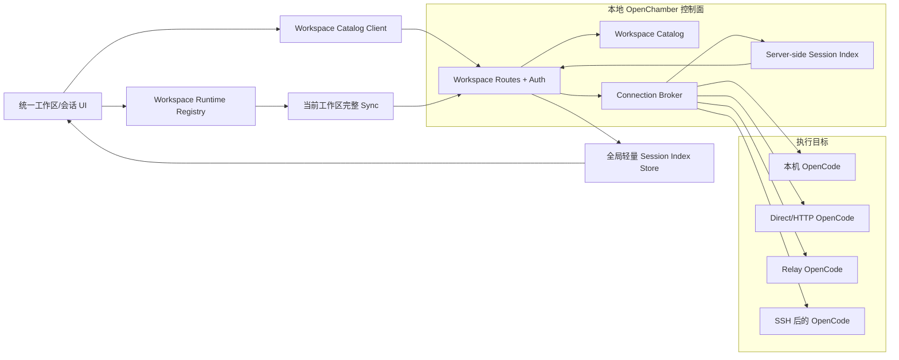

# 统一工作区与会话架构执行指导

> 状态：待实施的目标架构与执行规范
> 基线日期：2026-08-10
> 适用范围：`packages/ui`、`packages/web`、`packages/electron`、`packages/vscode`、`packages/mobile`
> 核心目标：以一个本地 OpenChamber 控制面统一管理所有服务器上的工作区与会话；用户不再通过切换服务器来切换会话。

## 1. 决策摘要

目标产品只有一种一等实体：**工作区**。每个工作区由"服务器连接 + 服务器上的路径"定位，会话归属于工作区。所谓"本地"仅表示所有工作区都登记在当前 OpenChamber 控制面的统一目录中，不表示远程代码、文件或会话被复制到本机。

最终交互和代码必须满足以下结论：

1. 侧边栏只展示统一的工作区与会话树，不再展示独立的本地项目区、远程 Fleet 区或服务器卡片。
2. "添加工作区"是一个统一流程：选择服务器，选择或填写该服务器上的路径，然后保存；当前电脑只是默认服务器。
3. 工作区和会话的主模型中不存在 `isLocal`、`isRemote` 或 `projectType` 分支。连接类型只存在于传输层内部。
4. 本地与远程可以使用辅助色、状态点或服务器名称作为次要信息，但不得改变排序、层级、可用操作或导航模型。
5. 打开任意会话只改变当前 `workspaceId`、`sessionId` 和绑定的运行时句柄，不得调用全局 `switchRuntimeEndpoint()`，也不得清空其他工作区的目录或摘要。
6. 浏览器始终连接当前 OpenChamber 控制面。远端认证、SSH、Relay 和上游 URL 由控制面解析，远端令牌不得进入渲染器。
7. 全局侧边栏维护轻量会话索引；完整消息、文件、Git、终端和权限状态只为当前工作区按需加载。
8. 连接失败必须保留上一次成功快照并标记为过期或不可达，不能表现为"没有会话"。

一句话架构是：

> `本地统一目录 -> 工作区(connectionId + path) -> 会话(workspaceId + upstreamSessionId) -> 工作区绑定运行时句柄 -> 服务器侧连接代理`

## 2. 目标、范围与非目标

### 2.1 目标

- 在同一个侧边栏中平等展示本机、直连服务器、Relay 服务器和 SSH 服务器上的工作区与会话。
- 让用户可以从任意会话直接跳转到另一个服务器上的会话，不经历服务器切换、整页重置或单独窗口切换。
- 让工作区目录、排序、颜色、折叠状态和会话轻量摘要由一个控制面统一提供。
- 让每次 SDK、HTTP、SSE、WebSocket、文件、Git、终端和权限调用都能明确路由到会话所属工作区。
- 在 Web、Electron、VS Code、Hosted Mobile 和 Capacitor Mobile 上使用相同的工作区身份与会话身份。
- 保留现有 Fleet 中已经正确实现的失败快照保留、SSE 新旧数据协调、退避和并发上限能力，但删除 Fleet 的产品分区和全局运行时切换职责。

### 2.2 本期非目标

- 不复制或同步远程仓库、OpenCode 会话正文、终端进程或 Git 状态到本机。
- 不合并两个彼此独立的 OpenChamber 控制面的目录。本期"跨端统一"指多个客户端连接同一个控制面时看到同一目录。
- 不让 Capacitor、Hosted Mobile 或浏览器直接持有每台远程服务器的凭据。
- 不把 OpenChamber 实现为任意 URL 的通用反向代理。
- 不自动合并指向同一物理服务器但由用户分别创建的两个连接档案。
- 不在无法确定归属时用路径前缀猜测会话属于哪个工作区。
- 不在本次改造中重写 OpenCode 的会话存储协议。

## 3. 术语与产品语义

| 术语 | 定义 | 用户是否直接感知 |
|---|---|---|
| 控制面（Control Plane） | 当前客户端连接的 OpenChamber 服务，持有统一目录、公开连接元数据和路由能力 | 是，表现为当前 OpenChamber 实例 |
| 连接档案（Connection Profile） | 一个逻辑服务器及其访问方式；凭据只在服务端或 Electron main 中解析 | 仅在设置和添加工作区时感知 |
| 工作区（Workspace） | 稳定 UUID 标识的目录项，由 `connectionId + canonicalPath` 定位 | 是，侧边栏一等实体 |
| 会话引用（Session Ref） | 工作区内一个 OpenCode 会话的轻量引用 | 是，工作区下的一等实体 |
| 工作区范围键（Workspace Scope Key） | 所有客户端缓存、同步和持久化的隔离键，首选稳定 `workspaceId` | 否 |
| 工作区运行时句柄（Workspace Runtime Handle） | 绑定到某一工作区的 SDK、RuntimeAPIs、URL 解析和生命周期对象 | 否 |
| 会话索引（Session Index） | 控制面维护的跨连接轻量会话摘要，不包含消息正文 | 仅通过侧边栏结果感知 |

代码审查时必须区分两种"本地"：

- **本地目录权威**：所有工作区记录都由当前控制面统一管理。这是本方案要求的"只保留本地"。
- **本机执行目标**：工作区实际位于当前机器。这只是连接档案的一种内部传输实现，不是产品实体类型。

## 4. Codex 公开资料给出的约束

公开资料可以确认下列产品和协议特征：

- [Codex Projects](https://learn.chatgpt.com/docs/projects) 将聊天按项目和文件夹组织，项目是用户浏览的主层级。
- [Codex Remote connections](https://learn.chatgpt.com/docs/remote-connections) 的添加语义是选择远程主机和该主机上的文件夹，而不是进入另一套远程产品模式。
- [Codex App Server](https://learn.chatgpt.com/docs/app-server) 公开了稳定 thread ID、工作目录及 thread 级操作，说明会话身份与工作目录可以独立于当前视图存在。

公开文档没有披露 Codex 桌面端内部 Store、缓存或多连接聚合实现。因此，本文件只把公开行为作为产品约束；控制面目录、连接代理、会话索引和运行时句柄是 OpenChamber 为满足这些约束提出的实现，不应声称为 Codex 私有实现的复刻。

## 5. 当前实现基线与必须替换的耦合

当前分支已经能发现多台服务器，但仍是"一个 Active Runtime + 多个只读 Fleet 摘要"的架构。服务器切换仍是导航的前置动作。

| 当前模块 | 当前职责 | 与目标冲突 |
|---|---|---|
| `packages/ui/src/fleet/types.ts` | 将非活跃服务器建模为摘要源 | 默认假设只有一个运行时拥有完整数据 |
| `packages/ui/src/fleet/fleet-store.ts` | 保存 `activeServerId` 并激活服务器 | 服务器被放在会话导航之前 |
| `packages/ui/src/fleet/fleet-navigation.ts` | 先激活服务器，再选择会话 | 点击会话会触发全局运行时切换 |
| `packages/ui/src/fleet/FleetSummaryBridge.tsx` | 轮询或订阅非活跃服务器摘要 | 可保留算法，但不应继续作为独立产品分区 |
| `packages/ui/src/components/session/sidebar/FleetSidebarSection.tsx` | 显示远程服务器卡片 | 破坏工作区与会话的平等层级 |
| `packages/ui/src/lib/runtime-switch.ts` | 维护全局 `activeApiBaseUrl` 和 `activeRuntimeKey` | 进程级可变端点无法支持并列工作区 |
| `packages/ui/src/apps/runtimeEndpointReset.ts` | 切换端点时清空大量 Store | 跨服务器会话导航变成破坏性全局重置 |
| `packages/ui/src/stores/useProjectsStore.ts` | 按当前 API Base URL 保存项目 | 项目目录被运行时分片，不能形成统一目录 |
| `packages/ui/src/lib/projectId.ts` | 使用路径生成项目身份 | 不同服务器的同路径发生碰撞，重命名也不稳定 |
| `packages/ui/src/stores/useGlobalSessionsStore.ts` | 只保存当前运行时会话 | 切换运行时会清空其他服务器会话 |
| `packages/ui/src/sync/sync-context.tsx` | 从全局运行时取得 `runtimeKey` | 同步作用域依赖环境变量而非工作区参数 |
| `packages/ui/src/sync/session-message-loader.ts` | 一个 loader 绑定一个 SDK 和 runtime key | 重配置会清空另一个工作区的加载状态 |
| `packages/ui/src/lib/opencode/client.ts` | 暴露单例 OpenCode SDK | 所有调用隐式指向当前端点 |
| `packages/ui/src/lib/runtime-fetch.ts` | 解析并认证当前活动运行时 | 目标选择是全局状态而非调用参数 |
| `packages/web/src/api/index.ts` | 构造一套当前运行时 `RuntimeAPIs` | 文件、Git、终端等能力无法绑定工作区 |
| `packages/electron/main.mjs` | 持有 Desktop Host 和 SSH 生命周期 | 能力正确，但目前服务于切换窗口/运行时模型 |

以下现有能力应被复用，而不是删除后重写：

- `fleet-live-store.ts` 对"快照不能覆盖更新 SSE"的 revision 协调。
- `fleet-summary-store.ts` 在请求失败时保留上次快照。
- `fleet-summary-transport.ts` 的并发限制、退避和窄事件过滤。
- `packages/web/server/lib/event-stream` 的单上游流、浏览器复用、重放和背压思想。
- `packages/electron/ssh-manager.mjs` 的原生 SSH 生命周期与清理职责。
- `RuntimeAPIs` 对 OpenChamber 自有能力的统一抽象。

## 6. 不可妥协的架构不变量

### 6.1 身份与导航

1. `workspaceId` 是创建后不变的随机 UUID，不从路径、URL 或服务器名称计算。
2. 工作区唯一约束是 `(connectionId, canonicalPath)`；规范化必须在目标服务器语义下完成。
3. 全局会话键是 `(workspaceId, upstreamSessionId)`，不得只使用上游 session ID。
4. 任意组件不得通过读取 `window.location`、当前 API Base URL 或全局 runtime key 猜测工作区归属。
5. 点击会话只调用 `selectWorkspaceSession({ workspaceId, sessionId })`；导航路径内禁止调用 `switchRuntimeEndpoint()`。
6. 连接状态是工作区的附属状态，不是工作区存在性的来源。服务器离线时工作区仍必须留在目录中。

### 6.2 数据正确性

1. 权威请求失败不得写入空数组来替换旧数据。
2. 每个连接和工作区分别携带 `complete`、`stale`、`lastSuccessAt` 和 `error`；一个连接失败不得阻断其他连接。
3. SSE/WS 增量只能覆盖早于自身 revision 的快照；晚到快照不得回滚新状态。
4. 删除工作区只删除目录引用和本地 UI 缓存，不删除远程目录、文件、会话或终端。
5. 删除仍被工作区引用的连接必须被阻止，或者要求显式迁移/删除引用后再执行。
6. 历史会话只在目录完全相等或存在显式绑定时自动归属；重叠路径不得用最长前缀静默猜测。

### 6.3 安全边界

1. 渲染器只能看到公开连接摘要；令牌、自定义认证头、Relay 凭据和 SSH 私钥不得出现在 API 响应、URL、日志或 Local Storage 中。
2. `workspaceId` 必须在服务端解析为已保存的连接和路径；客户端不得传入任意 upstream URL。
3. 工作区代理必须使用允许的方法和路径集合，不能成为任意网络代理。
4. 路径浏览、文件、终端、Git 和权限/问题响应必须同时校验工作区和目录边界。
5. Electron 原生能力继续由 main process 持有；远程内容或普通渲染器不得直接调用全局 IPC。
6. 所有新增 HTTP、SSE 和 WebSocket 路径必须同步更新 UI auth、URL token、Relay host allowlist 和相应安全测试。

### 6.4 性能与生命周期

1. 空闲时不得按工作区轮询；同一连接最多维持一个全局事件流。
2. 侧边栏事件更新必须只修改受影响的连接、工作区和会话，不能每个事件扫描全部服务器和会话。
3. 完整消息与文件状态只为当前工作区加载；后台只保留有上限的会话摘要。
4. 每个连接代理、事件流、Relay tunnel、SSH tunnel 和 WorkspaceRuntimeHandle 都必须有明确 owner、ref count/lease 和 `dispose()`。
5. EOF、认证失败和网络错误都必须进入断开状态并退避，不能形成零延迟重连循环。

## 7. 目标总体架构



### 7.1 分层职责

#### A. Workspace Catalog

- 是工作区、公开连接元数据、排序、颜色和迁移版本的唯一权威。
- 运行在 OpenChamber 服务端，所有连接同一控制面的客户端共享。
- 使用单调 `revision` 和串行写入，避免多个标签页覆盖。
- 不保存消息正文、终端数据或远端凭据明文响应。

#### B. Connection Broker

- 将 `connectionId` 解析为本机、Direct、Relay 或 SSH 适配器。
- 负责认证注入、连接复用、路径规范化、探测、HTTP/SSE/WS 转发和清理。
- 对上层只暴露目标无关接口；上层不得按 `kind` 编写业务分支。

#### C. Server-side Session Index

- 每个可达连接最多一条上游事件流。
- 获取轻量 session 列表并把 session 映射到显式工作区。
- 输出跨连接 snapshot 和带 revision 的增量事件。
- 保留每个连接最后成功数据；离线、部分结果和权限错误独立表示。

#### D. Workspace Runtime Registry

- 在 UI 内按 `workspaceId` 创建或复用绑定句柄。
- 句柄包含 OpenCode SDK、RuntimeAPIs、URL 解析器和 `scopeKey`。
- 句柄请求仍发往当前控制面，通过工作区前缀由服务端转发。
- 允许对最近工作区做有上限缓存，但不允许全局端点突变。

#### E. Unified Workspace/Session UI

- 只消费 Catalog 和 Session Index。
- 选择会话后为该工作区挂载完整 Sync。
- 颜色仅为装饰性来源提示；状态必须有文字或图标，不得只靠颜色传达。

## 8. 领域模型与类型契约

以下类型应放在 `packages/ui/src/workspaces/types.ts`，服务端使用等价的 JSDoc/schema，并由 API contract test 保证一致。

```ts
export type ConnectionId = string
export type WorkspaceId = string
export type WorkspaceSessionKey = string
export interface ConnectionCapabilities {
  pathBrowse: boolean
  terminal: boolean
  files: boolean
  git: boolean
  eventStream: boolean
}
/** 可安全返回给普通浏览器的连接摘要。 */
export interface ConnectionProfileSummary {
  id: ConnectionId
  label: string
  accentColor?: string
  capabilities: ConnectionCapabilities
}
export interface WorkspaceDescriptor {
  id: WorkspaceId
  connectionId: ConnectionId
  path: string
  canonicalPath: string
  label: string
  color?: string
  orderKey: string
  createdAt: number
  updatedAt: number
}
export interface WorkspaceSessionSummary {
  key: WorkspaceSessionKey
  workspaceId: WorkspaceId
  upstreamSessionId: string
  directory: string
  title: string
  updatedAt: number
  archived: boolean
  activity?: "idle" | "busy" | "waiting"
}
export interface SourceFreshness {
  complete: boolean
  stale: boolean
  lastSuccessAt: number | null
  error: { code: string; message: string } | null
}
export interface WorkspaceCatalogSnapshot {
  schemaVersion: 1
  revision: number
  connections: ConnectionProfileSummary[]
  workspaces: WorkspaceDescriptor[]
}
export interface WorkspaceSessionSnapshot {
  revision: number
  sessions: WorkspaceSessionSummary[]
  freshnessByConnection: Record<ConnectionId, SourceFreshness>
}
```

### 8.1 私有连接记录

连接实现细节只能存在于服务端或 Electron main process：

```ts
type PrivateConnectionTarget =
  | { kind: "local" }
  | { kind: "direct"; baseUrl: string; credentialRef?: string }
  | { kind: "relay"; relayId: string; credentialRef: string }
  | { kind: "ssh"; sshInstanceId: string }
interface PrivateConnectionRecord {
  id: ConnectionId
  label: string
  target: PrivateConnectionTarget
  accentColor?: string
}
```

`kind` 只允许出现在 Broker/adapter 层。`WorkspaceDescriptor`、`WorkspaceSessionSummary`、侧边栏和导航 API 不得依赖它。

### 8.2 会话归属绑定

为避免重叠路径产生启发式错误，控制面维护轻量绑定：

```ts
interface WorkspaceSessionBinding {
  workspaceId: WorkspaceId
  upstreamSessionId: string
  observedDirectory: string
  source: "created-in-workspace" | "explicit" | "legacy-exact-path"
  updatedAt: number
}
```

绑定规则：

1. 从某工作区新建会话时立即写入 `created-in-workspace` 绑定。
2. 导入历史会话时，仅在规范化目录与工作区路径完全相等时写入 `legacy-exact-path`。
3. 无法唯一匹配的会话进入"未归属会话"诊断集合，不在任意工作区下静默展示。
4. 用户显式移动/归属后写入 `explicit` 绑定。
5. 上游 session 删除后清理绑定；连接离线时不得清理。

### 8.3 身份辅助函数

在 `packages/ui/src/workspaces/identity.ts` 集中实现，禁止散落字符串拼接：

```ts
export const workspaceScopeKey = (workspaceId: WorkspaceId) =>
  `workspace:${workspaceId}`
export const workspaceSessionKey = (
  workspaceId: WorkspaceId,
  upstreamSessionId: string,
) => `${workspaceId}\0${upstreamSessionId}`
```

服务端使用完全相同的编码或显式对象键。测试必须覆盖包含斜杠、Unicode、相同路径和相同 session ID 的情况。

## 9. 目录持久化、并发与迁移格式

### 9.1 权威存储

新增服务端文件 `workspace-catalog.json`，位于现有 `OPENCHAMBER_DATA_DIR`。它只保存低频变化的连接公开元数据和工作区目录：

```json
{
  "schemaVersion": 1,
  "revision": 42,
  "connections": [],
  "workspaces": [],
  "migration": {
    "legacyProjectsImported": true,
    "pendingConnectionIds": []
  }
}
```

实现要求：

- 读取时做运行时 schema 校验，字段损坏不能让进程崩溃或被当作空目录覆盖。
- 所有 mutation 进入同一串行队列：读取当前 revision、校验 `If-Match`、生成下一 revision、写临时文件、fsync/关闭、原子替换。
- 保留最近一个可解析备份；主文件损坏时进入恢复状态并明确报告，不能静默创建空文件。
- API 写操作返回新 revision。冲突返回 `409 catalog_revision_conflict`，客户端重新取 snapshot 后重放用户动作。
- 凭据不写入该文件；这里只保存不敏感元数据和不透明引用。

### 9.2 私有连接档案与凭据

Catalog 中的 `connections` 只保存可公开摘要。Broker 通过独立的 `ConnectionProfileStore` 和 `ConnectionCredentialProvider` 解析 `PrivateConnectionRecord`：

- Web/Headless 的 Direct/Relay 实现先复用现有服务端设置存储与凭据策略，通过 provider 读取，不能把秘密复制进 Catalog。
- Electron SSH 档案只保存 `sshInstanceId`，真实主机认证和 tunnel 生命周期仍由 Electron main/`ssh-manager.mjs` 所有。
- 如果运行环境已有 OS keychain 或安全凭据 provider，应保存不透明 `credentialRef`；本次改造不得暗示普通 JSON 已加密，也不得降低现有静态存储保护。
- 私有 Store 的 API 只能在服务端调用，公开 DTO 必须通过显式 serializer 构造，禁止对 private record 做对象展开后删除字段。
- 私有存储加载失败是连接配置错误，不得把 Catalog 中对应工作区删除或当作空目录。

### 9.3 会话绑定存储

`WorkspaceSessionBinding` 使用独立的 `workspace-session-bindings.json` 和独立 revision，由 Session Index 所有。会话创建、删除和显式归属不能放大 Catalog revision 或阻塞工作区排序、重命名等低频操作。

要求：

- 使用与 Catalog 相同的 schema 校验、串行写入、原子替换和可恢复备份原则。
- 以 `(connectionId, upstreamSessionId)` 建索引，并存储解析后的 `workspaceId`；同一物理连接内 session ID 应唯一。
- 删除工作区时只删除对应绑定；不得把删除传播到上游 session。
- 连接离线或 session snapshot 不完整时不做缺失清理。只有权威完整 snapshot 明确缺失后才能回收绑定。
- 绑定变化触发 Session Index revision，不触发 Catalog revision。

### 9.4 迁移来源

迁移程序需要处理：

- 当前运行时的 `settings.projects` 和 `useProjectsStore` 缓存。
- 每个 Desktop Host/SSH Host 对应运行时中的旧项目列表。
- 项目 label、color、order、折叠状态和 active session 映射。
- session folders、pins、drafts、queue、viewport、prefetch 和其他 runtime/directory/session 作用域的 UI 数据。

迁移顺序：

1. 创建内置 `local` 连接记录。
2. 把本机项目按 `(localConnectionId, canonicalPath)` 导入并分配稳定 UUID。
3. 为每个现有 Desktop Host/SSH Host 建立连接记录，但不把凭据复制到 UI catalog。
4. 仅在连接可达且项目列表成功获取时导入远程项目；失败连接写入 `pendingConnectionIds`，保留旧数据。
5. 提交并重新读取新目录，确认数量、ID、路径和 revision 后标记该连接迁移成功。
6. 先双读旧键与新键，所有新写只写 workspace key；至少一个发布周期后再移除旧读路径。
7. 只有目录和 UI 状态迁移都通过验证后，才允许删除旧 Fleet/项目分片数据。

迁移失败必须是可重试的。任何连接失败都不能把其项目解释为权威空列表，也不能阻止已成功连接完成迁移。

## 10. 控制面 API 契约

所有路由注册在基础 UI auth 之后、通用 OpenCode `/api/*` 代理之前。建议统一前缀如下：

### 10.1 目录和连接 API

| Method | Route | 作用 |
|---|---|---|
| `GET` | `/api/workspaces` | 返回目录 snapshot、公开连接摘要和 revision |
| `POST` | `/api/workspaces` | 使用 `{ connectionId, path, label?, color? }` 创建工作区 |
| `PATCH` | `/api/workspaces/:workspaceId` | 修改 label、color、orderKey；带 `If-Match` |
| `DELETE` | `/api/workspaces/:workspaceId` | 只删除目录引用，不触碰上游数据 |
| `POST` | `/api/workspaces/:workspaceId/probe` | 检查连接、路径和能力，不改变目录 |
| `GET` | `/api/workspaces/:workspaceId/children?path=...` | 在目标服务器上浏览目录 |
| `GET` | `/api/connections` | 返回可选的公开连接摘要 |
| `POST` | `/api/connections/:connectionId/probe` | 探测连接并返回脱敏错误 |

创建工作区的服务端步骤必须固定为：

1. 验证 `connectionId` 已登记且当前用户有权使用。
2. 通过对应 adapter 规范化路径；不得使用控制面本机的 `path.resolve()` 处理远程路径。
3. 验证路径存在、为目录且没有逃逸 adapter 的允许边界。
4. 检查 `(connectionId, canonicalPath)` 唯一约束。
5. 分配 UUID，写入 catalog，返回新 revision 和完整 descriptor。

### 10.2 会话索引 API

| Method/Transport | Route | 作用 |
|---|---|---|
| `GET` | `/api/workspace-sessions/snapshot` | 返回所有工作区轻量会话和分连接 freshness |
| WebSocket | `/api/workspace-sessions/events` | 返回带全局 revision 的增量事件 |
| `POST` | `/api/workspaces/:workspaceId/sessions` | 在指定工作区创建会话并写入绑定 |
| `POST` | `/api/workspaces/:workspaceId/sessions/:sessionId/bind` | 显式修复/移动会话归属 |

事件封装必须包含明确作用域：

```ts
type WorkspaceSessionEvent = {
  revision: number
  connectionId: ConnectionId
  workspaceId: WorkspaceId
  sessionId: string
  type: "session.upserted" | "session.removed" | "freshness.changed"
  payload: unknown
}
```

客户端收到 revision 缺口时重新获取 snapshot；snapshot 应用规则沿用 Fleet live store 的"较新增量不被较旧快照覆盖"策略。

### 10.3 工作区绑定运行时代理

统一代理前缀：

```text
/api/workspaces/:workspaceId/runtime/*
```

路由规则：

- 解析 `workspaceId`，取得 `connectionId` 和 canonical path。
- 去掉工作区前缀后只允许转发已登记的 OpenCode/OpenChamber 路径。
- SDK base URL 使用 `/api/workspaces/:workspaceId/runtime/api`。
- 必须覆盖 HTTP、SSE 和 WebSocket，不能只实现普通 fetch。
- 终端、文件、Git 和其他目录相关请求由服务端注入/验证工作区目录。
- 上游凭据在 Broker 内加入；浏览器请求和 URL token 中不包含上游凭据。
- 代理响应不得把上游认证头、内部 URL 或 SSH 细节回传给客户端。

新增 WebSocket 路径时必须更新中央 upgrade dispatcher，不能只添加 Express/Hono 路由后假设升级自动生效。

## 11. Connection Broker 与传输实现

在 `packages/web/server/lib/workspaces/connection-broker.js` 定义目标无关接口：

```js
/**
 * @typedef {Object} WorkspaceConnectionAdapter
 * @property {(context: object, request: Request) => Promise<Response>} fetch
 * @property {(context: object) => AsyncIterable<object>} openEventStream
 * @property {(context: object, request: object) => Promise<object>} openWebSocket
 * @property {(context: object) => Promise<object>} probe
 * @property {(context: object, inputPath: string) => Promise<string>} canonicalizePath
 * @property {() => Promise<void>} dispose
 */
```

### 11.1 Adapter 规则

| Adapter | 所有者 | 实现要求 |
|---|---|---|
| Local | `packages/web` | 复用当前 managed/external OpenCode runtime 与 feature routes；是否走 loopback 由现有 runtime owner 决定，不再由浏览器切换端点 |
| Direct | `packages/web` | 服务端请求远端、注入保存凭据、严格 host/path allowlist |
| Relay | `packages/web` | 使用 connection-keyed tunnel registry；每连接复用并有 lease/idle cleanup |
| SSH | Electron main 注入 | 复用 `ssh-manager.mjs`，只把窄的 adapter/callback 注入 in-process web server |

Electron 的依赖方向必须保持：

```text
electron main -> startWebUiServer({ workspaceConnectionAdapter })
packages/web  -X-> packages/electron
renderer      -X-> SSH/private credential IPC
```

`packages/web` 不得 import Electron。Electron 通过 `startWebUiServer` 参数提供 SSH 的 `probe`、`fetch/forward`、事件流和 cleanup 能力；Web/Headless 没有 SSH adapter 时返回明确的 `capability_unavailable`，不能伪装成本机连接失败。

### 11.2 连接生命周期

每个逻辑连接维护以下状态：

```ts
type ConnectionLifecycle =
  | { state: "idle" }
  | { state: "connecting"; attempt: number }
  | { state: "ready"; connectedAt: number }
  | { state: "backoff"; attempt: number; retryAt: number; error: string }
  | { state: "disposed" }
```

- catalog 中存在连接不等于必须立即建立 tunnel。
- Session Index 或活动 WorkspaceRuntimeHandle 获取 lease 时建立连接。
- 最后一个 lease 释放后进入有界 idle grace period，再关闭 tunnel/event stream。
- EOF 等价于断开，进入 backoff；认证失败等待用户修复，不做无限快速重试。
- 一个连接状态变化只更新引用该连接的工作区 freshness。

### 11.3 Relay 和事件协议

- 当前 Relay 客户端若依赖浏览器单例，需拆成 connection-keyed、环境无关的 transport factory。
- UI 只连接控制面的路径；远端 Relay 细节由 Broker 处理。
- 修改帧格式时服务端与客户端必须同批更新，并增加真实握手、认证、close/EOF、背压和重连测试。
- 每个连接最多一条 OpenCode 全局事件流；不得为每个工作区开一条上游 SSE。
- 仅转发 session 列表所需字段和事件，消息正文由活动工作区完整 Sync 获取。

## 12. UI 运行时与同步改造

### 12.1 WorkspaceRuntimeHandle

新增 `packages/ui/src/workspaces/workspace-runtime-registry.ts`：

```ts
export interface WorkspaceRuntimeHandle {
  workspaceId: WorkspaceId
  scopeKey: string
  sdk: OpencodeClient
  apis: RuntimeAPIs
  urls: RuntimeUrlResolver
  retain(): () => void
  dispose(): void
}
export interface WorkspaceRuntimeRegistry {
  get(workspace: WorkspaceDescriptor): WorkspaceRuntimeHandle
  invalidate(workspaceId: WorkspaceId): void
  dispose(): void
}
```

句柄构造原则：

1. 所有 base URL 都是当前控制面上的工作区前缀，不是远端 URL。
2. `opencode/client.ts` 改为显式 factory，接受 `baseUrl` 和注入 fetch；单例仅作为迁移期兼容 facade。
3. `runtime-fetch.ts` 继续处理控制面 origin/auth；新增纯函数把目标路径改写到 workspace prefix，不写全局变量。
4. `RuntimeAPIs` 的 files、git、terminal、settings 等实现从句柄取得 workspace-bound fetch/URL resolver。
5. registry 对非活动句柄使用有界 LRU/lease；不得永久保存每个工作区的完整 store。

### 12.2 SyncProvider

`packages/ui/src/sync/sync-context.tsx` 的目标 props：

```ts
interface SyncProviderProps {
  workspaceId: WorkspaceId
  scopeKey: string
  sdk: OpencodeClient
  directory: string
  children: React.ReactNode
}
```

修改要求：

- 不再调用环境级 `getRuntimeKey()`。
- `ChildStoreManager`、`SessionMessageLoader`、selection、activity、persist cache 全部接收显式 `scopeKey`。
- 当前工作区变化时只卸载旧工作区的完整 Sync owner；全局 Catalog 和 Session Index Store 不重置。
- 旧工作区 inflight 请求返回时必须通过 owner generation/scope 检查丢弃，不能写入新工作区。
- `session.updated` 只更新结构字段；recency-only 更新不得触发完整 session list 重拉。

### 12.3 Store 键迁移

以下模块必须从 ambient runtime key 或 path-only key 改为显式 workspace scope：

- `packages/ui/src/sync/persist-cache.ts`
- `packages/ui/src/sync/session-prefetch-cache.ts`
- `packages/ui/src/sync/viewport-store.ts`
- `packages/ui/src/sync/session-deletion-cleanup.ts`
- `packages/ui/src/sync/selection-store.ts`
- `packages/ui/src/sync/session-ui-store.ts`
- `packages/ui/src/stores/useSessionFoldersStore.ts`
- `packages/ui/src/stores/useSessionPinnedStore.ts`
- `packages/ui/src/stores/messageQueueStore.ts`
- 草稿、todo、文件标签、Git、PR、搜索和终端相关的 session/directory 缓存。

所有公共 helper 使用对象参数，避免错传相邻字符串：

```ts
type SessionScope = {
  workspaceId: WorkspaceId
  sessionId: string
}
cleanupDeletedSession({ workspaceId, sessionId })
```

### 12.4 兼容 facade 的退出条件

可以短期保留 `getOpencodeClient()`、`getRuntimeKey()` 和 `switchRuntimeEndpoint()` 供未迁移入口使用，但必须满足：

- 新代码禁止调用这些 API。
- 加入调用点清单和测试，数量只能下降。
- 跨工作区导航路径先完全摆脱 facade，再启用统一 UI。
- 最终阶段删除 facade、runtime reset 和相关测试；不能把旧切换隐藏在新按钮后。

### 12.5 Mini Chat、托盘、通知和新窗口

主窗口之外的消费者最容易继续继承"当前服务器"，必须统一改用显式目标：

```ts
interface WorkspaceSessionTarget {
  workspaceId: WorkspaceId
  sessionId: string
}
```

- `ElectronMiniChatApp` 的启动参数只携带 `workspaceId/sessionId`，在窗口内通过当前控制面解析 WorkspaceRuntimeHandle；不得携带远端 base URL 或 token。
- 托盘状态从全局 Session Index/活动状态聚合，不读取最后激活的 Desktop Host，也不能在一次 `session.updated` 后清空其他连接状态。
- 通知记录和点击动作必须保存 `WorkspaceSessionTarget`；点击后直接定位该工作区会话。
- `desktop_new_window_at_url`、deep link 和窗口恢复只允许当前控制面 origin 下的受控 workspace/session route，继续执行现有远程 sender 授权。
- 窗口标题从 Catalog 的工作区 label 和会话 title 生成，服务器名称只用于必要消歧。
- 这些后台消费者持有 handle lease 时必须释放；窗口关闭、通知过期和托盘重建都要有清理测试。

## 13. 统一产品流程

### 13.1 添加工作区

删除"本地 / 远程项目类型"第一步。统一对话框包含：

1. **服务器**：默认"此电脑"，也可选择设置中已登记服务器。
2. **路径**：通过所选服务器的目录浏览器选择，或手工输入后探测。
3. **名称**：默认取 canonical path basename，可编辑。
4. **颜色**：可选，仅用于辅助识别。
5. **添加工作区**：服务端成功提交后一次性插入目录。

添加失败时保留用户输入并展示脱敏、可行动的错误。探测失败不创建半成品；catalog 写入成功但客户端响应丢失时，重试依赖唯一约束返回已有 descriptor，避免重复。

### 13.2 侧边栏

目标层级固定为：

```text
工作区 A                         [辅助状态]
  会话 1
  会话 2
工作区 B                         [辅助状态]
  会话 3
```

- 不再渲染 `FleetSidebarSection` 和服务器卡片。
- 所有工作区共享排序、折叠、拖拽和会话分页规则。
- 服务器名称只在同名工作区消歧、tooltip 或次要文本中出现。
- 离线时保留会话，显示"上次同步时间 / 无法连接"；不得显示"没有聊天"。
- 颜色不能作为唯一的本地/远程或在线/离线信息。

### 13.3 打开会话

```ts
async function openWorkspaceSession(target: {
  workspaceId: WorkspaceId
  sessionId: string
}) {
  selectionStore.select(target)
  const handle = workspaceRuntimeRegistry.get(
    workspaceCatalog.require(target.workspaceId),
  )
  activeWorkspaceHost.mount(handle, target.sessionId)
}
```

交互必须先立即显示选中反馈，再异步连接/恢复完整内容。失败时保留侧边栏和当前选择，显示可重试错误；不得清空整个应用状态。

### 13.4 设置

- "远程实例"页面调整为"服务器"或"连接"，只负责创建、编辑、探测和删除连接档案。
- 工作区创建不在设置页分叉成本地/远程模式。
- 使用现有 Settings primitives、页面 registry、anchor 和 search keywords。
- 所有新增标题、按钮、状态、错误、placeholder、tooltip 和 aria label 必须加入 `packages/ui/src/lib/i18n/messages/*` 的全部 locale。

## 14. 跨运行时职责矩阵

| Runtime | Catalog | 工作区代理 | 连接管理 | SSH | 本地文件能力 |
|---|---|---|---|---|---|
| Web/Headless | 服务端权威 | Local/Direct/Relay | 服务端设置 | V1 明确不支持，除非注入 adapter | 仅控制面所在机器 |
| Electron | in-process web server 权威 | Local/Direct/Relay/SSH | Electron main + 服务端窄接口 | 支持，复用 ssh-manager | 由目标工作区决定 |
| VS Code | 使用同一类型和 local workspace descriptor | 通过 extension/webview bridge | V1 可只读或显式不支持新增远端 | 明确 capability unavailable | 当前 VS Code workspace |
| Hosted Mobile | 消费已连接控制面的 catalog | 只连接控制面 | 不持有所有远端秘密 | 不直接支持 | 无本地 shell/文件系统 |
| Capacitor Mobile | 消费已连接控制面的 catalog | 只连接控制面 | 与 Hosted Mobile 相同 | 不直接支持 | 受 Capacitor 能力限制 |

任何 runtime 未实现能力必须通过 `ConnectionCapabilities` 和明确 UI 状态表示，不能让 shared UI 调用不存在的 bridge。

## 15. 逐模块代码执行清单

文件名是推荐落点；实施时若最近的 `DOCUMENTATION.md` 要求不同名称，可以调整文件名，但不得改变职责边界。

### 15.1 新增服务端模块

在 `packages/web/server/lib/workspaces/` 新建：

| 文件 | 代码职责 | 必测内容 |
|---|---|---|
| `catalog-schema.js` | 运行时校验、schema version、公开 DTO 脱敏 | 损坏字段、未知版本、秘密字段拒绝 |
| `catalog-store.js` | 原子加载/写入、revision、备份、mutation queue | 并发写、崩溃恢复、409、失败不置空 |
| `workspace-identity.js` | UUID、唯一键、session key、路径比较契约 | 相同路径跨连接、Unicode、冲突 |
| `connection-profile-store.js` | 私有 target/credential provider、公开 DTO serializer | 脱敏、损坏配置、现有凭据迁移 |
| `session-binding-store.js` | 独立保存显式/导入会话归属和 revision | 幂等绑定、完整快照清理、离线不清理 |
| `connection-broker.js` | adapter registry、lease、probe、fetch/SSE/WS、dispose | 生命周期、单连接失败隔离、凭据不泄露 |
| `local-adapter.js` | 绑定现有本机 OpenCode runtime | 复用既有生命周期、目录边界、无浏览器端点切换 |
| `direct-adapter.js` | 允许列表内的直连目标 | SSRF、认证、重定向、超时 |
| `relay-adapter.js` | connection-keyed Relay tunnel | 握手、EOF、backoff、并发和清理 |
| `session-index.js` | 每连接 snapshot/event、绑定和 freshness | 快照/SSE 竞态、部分失败、stale |
| `runtime-proxy.js` | workspace 前缀 HTTP/SSE/WS 路由 | 路径重写、method allowlist、响应脱敏 |
| `migration.js` | 旧 projects/Fleet/UI scope 导入状态 | 幂等、断点续跑、不可达连接 |
| `routes.js` | Catalog、session index、probe、runtime proxy 的显式路由 | auth、输入 schema、错误码 |
| `DOCUMENTATION.md` | ownership、协议、不变量、故障语义 | 文档随实现更新 |

测试与模块相邻，至少包含 `catalog-store.test.js`、`connection-profile-store.test.js`、`session-binding-store.test.js`、`connection-broker.test.js`、`session-index.test.js`、`runtime-proxy.test.js`、`migration.test.js` 和真实 WebSocket upgrade 集成测试。

### 15.2 修改 Web Server 入口和协议模块

| 文件/目录 | 修改 |
|---|---|
| `packages/web/server/index.js` | 创建 catalog/broker/index；在 auth 后、generic proxy 前注册 workspace routes；在 shutdown 中 dispose |
| `packages/web/server/lib/opencode/feature-routes-runtime.js` | 明确 workspace 显式路由与通用 proxy 的顺序；禁止 generic proxy 抢占 |
| `packages/web/server/lib/event-stream/` | 抽取可按 connection 复用的上游流能力，保留 replay/backpressure；不要复制一套无界 hub |
| `packages/web/server/lib/relay/` | 增加 connection-keyed 客户端/tunnel lease；保持客户端/服务端协议同步 |
| `packages/web/server/lib/ui-auth/` | 为新 HTTP/WS 路径补认证和 URL token allowlist |
| `packages/web/server/lib/terminal/` | 终端 route/session owner 显式绑定 workspace；跨工作区 ID 不可访问 |
| `packages/web/server/lib/fs/` | 所有路径基于 adapter canonical path 校验，不使用控制面路径语义处理远端路径 |

### 15.3 新增共享 UI 工作区模块

在 `packages/ui/src/workspaces/` 新建：

| 文件 | 职责 |
|---|---|
| `types.ts` | 公开 API 和 UI 共享类型 |
| `identity.ts` | workspace/session scope key helper |
| `catalog-client.ts` | Catalog CRUD、revision conflict、snapshot revalidate |
| `catalog-store.ts` | 目录状态、optimistic mutation 和权威回滚 |
| `session-index-client.ts` | snapshot + WebSocket、revision 缺口恢复 |
| `session-index-store.ts` | 按 workspace 索引、per-connection freshness、局部更新 |
| `workspace-runtime-fetch.ts` | 纯工作区路径改写，不修改 global endpoint |
| `workspace-runtime-registry.ts` | SDK/RuntimeAPIs/URL resolver 句柄、lease、LRU、dispose |
| `WorkspaceRuntimeProvider.tsx` | 为当前工作区提供句柄与完整 Sync |
| `AddWorkspaceDialog.tsx` | 统一服务器 + 路径创建流程 |
| `DOCUMENTATION.md` | UI ownership、identity、缓存和导航不变量 |

### 15.4 修改共享 UI 现有模块

| 文件 | 具体改动 |
|---|---|
| `packages/ui/src/lib/api/types.ts` | 增加 Workspace Catalog/Session Index API；目录相关调用接受显式 workspace scope |
| `packages/web/src/api/index.ts` | 构造 control-plane API 和 workspace-bound API factory，停止为每个选择重设全局 resolver |
| `packages/ui/src/contexts/RuntimeAPIProvider.tsx` | 根 Provider 只提供控制面能力；当前工作区 RuntimeAPIs 由 WorkspaceRuntimeProvider 提供 |
| `packages/ui/src/lib/opencode/client.ts` | 单例改 factory；显式 `baseUrl/fetch`；迁移期 facade 标注 deprecated |
| `packages/ui/src/lib/runtime-fetch.ts` | 保留控制面认证；移除依赖当前远端 host 的隐式选择 |
| `packages/ui/src/sync/sync-context.tsx` | 接收 workspaceId/scopeKey/sdk/directory，不读取 ambient runtime key |
| `packages/ui/src/sync/session-message-loader.ts` | 每个 owner 绑定 handle/scope；旧 scope 响应不可落入新 scope |
| `packages/ui/src/stores/useProjectsStore.ts` | 先改为 Catalog adapter，随后由 workspace catalog store 取代；不再按 API Base URL 分片 |
| `packages/ui/src/lib/projectId.ts` | 停止作为权威身份；只保留 legacy migration helper 后删除 |
| `packages/ui/src/stores/useGlobalSessionsStore.ts` | 由 workspace session index store 取代；不再 runtime switch reset |
| `packages/ui/src/components/session/SessionSidebar.tsx` | 统一遍历 workspaces 和 sessions；选择使用复合 target |
| `packages/ui/src/components/session/DirectoryExplorerDialog.tsx` | 接受 connection/workspace browser API，不直接依赖当前 runtime |
| `packages/ui/src/components/sections/remote-instances/RemoteInstancesPage.tsx` | 重命名产品文案为服务器/连接；仅管理连接档案 |
| `packages/ui/src/apps/ElectronMiniChatApp.tsx`、`renderElectronMiniChatApp.tsx` | 入口改收 WorkspaceSessionTarget，并在窗口内解析 workspace handle |
| `packages/ui/src/hooks/useTraySync.ts` | 从全局 Session Index 聚合，不继承当前 endpoint；按连接保留状态 |
| `packages/ui/src/hooks/useWebNotificationStream.ts`、`packages/ui/src/sync/notification-store.ts` | 通知携带 workspaceId/sessionId，点击直达复合目标 |
| `packages/ui/src/hooks/useWindowTitle.ts` | 从 Catalog/当前会话生成标题，不以 Desktop Host 匹配作为身份 |
| `packages/ui/src/lib/settings/metadata.ts` | 更新设置页标题、可用 runtime 和 deep link 元数据 |
| `packages/ui/src/lib/settings/search.ts` | 更新搜索关键词、section anchor 和定位测试 |
| `packages/ui/src/lib/i18n/messages/*` | 全 locale 增加统一工作区、服务器、stale/offline/error 文案 |

### 15.5 Electron

| 文件 | 具体改动 |
|---|---|
| `packages/electron/main.mjs` | 启动 in-process web server 时注入窄 `workspaceConnectionAdapter`；停止用 host 切换驱动普通会话导航 |
| `packages/electron/tray.mjs` | 消费跨工作区聚合状态；菜单项携带 WorkspaceSessionTarget，不携带远端 URL |
| `packages/electron/ssh-manager.mjs` | 暴露按 sshInstanceId 获取 lease/probe/forward/dispose 的 main-only 接口；保持清理权威 |
| `packages/electron/preload.mjs` | 不新增泛化网络或秘密读取 IPC；仅在确有 native UI 需要时加窄桥接 |
| `packages/electron/ipc-security.test.mjs` | 证明远程 sender 无法枚举秘密、打开全局 IPC 或越过 workspace scope |
| `packages/electron/ssh-manager.test.mjs` | 覆盖多个工作区复用同一 SSH tunnel、最后 lease 清理和错误恢复 |

建议新增 `packages/electron/workspace-connection-adapter.mjs` 作为 `ssh-manager` 到 `startWebUiServer` 的薄适配器。领域状态仍归 `packages/web/server/lib/workspaces`，不得堆入 `main.mjs`。

### 15.6 VS Code 与 Mobile

| 模块 | 具体改动 |
|---|---|
| `packages/vscode/src/` | 当前 VS Code folder 映射为稳定 workspace descriptor；bridge 请求带 workspaceId；不支持的连接操作返回 capability unavailable |
| `packages/vscode/webview/` | 消费同一 Catalog/RuntimeAPIs 类型，不硬编码 localhost 或远端 URL |
| `packages/mobile/` | 只连接控制面 Catalog 和 workspace prefix；生命周期恢复后先重取 revision，再恢复当前 workspace/session |
| Hosted mobile web surface | 不把连接秘密同步到浏览器；Relay 仅承载控制面路径 |

### 15.7 切换完成后删除

只有下列退出门禁全部通过，才删除：

- `packages/ui/src/components/session/sidebar/FleetSidebarSection.tsx` 及其渲染入口。
- `fleet-store.ts` 中 `activeServerId` 和 activate 逻辑。
- `fleet-navigation.ts` 的全局 runtime switch 路径。
- 被 Session Index 替代的 Fleet summary/live store；先迁移其正确的协调算法和测试。
- `packages/ui/src/apps/runtimeEndpointReset.ts` 中仅为普通会话切换存在的清空逻辑。
- `packages/ui/src/lib/runtime-switch.ts` 和全局 client facade 的无剩余调用部分。
- path-only `projectId`、按 API Base URL 分片的 projects cache 和 legacy 双读逻辑。

删除源文件、导出或入口后必须运行 `bun run dead-code` 并检查报告。

## 16. 分阶段实施顺序与退出门禁

每一阶段都必须形成可回退、可测试的纵向切片，不能先大规模删除旧实现。

### Phase 0：冻结行为与增加防回归测试

工作：

- 为当前 Fleet snapshot/SSE revision、失败保留和退避补足测试。
- 增加测试捕获"点击远端会话调用 `switchRuntimeEndpoint` 并清空状态"的当前行为，作为后续反向断言。
- 记录当前 settings/projects/Fleet 数据样本和迁移预期。
- 增加安全基线：renderer 得不到 token/headers，远程 sender 无全局 IPC。

退出门禁：现有行为被可重复测试覆盖；没有产品改动。

### Phase 1：Catalog 与本机工作区垂直切片

工作：

- 实现 catalog schema/store/routes/client。
- 导入内置 local connection 和本机 projects。
- `useProjectsStore` 双读 Catalog，写新 Catalog。
- 新增统一 Add Workspace dialog，但暂时只启用"此电脑"。

退出门禁：重启、多标签并发、损坏恢复、增删改顺序、路径冲突均通过；旧 projects 仍可回退。

### Phase 2：WorkspaceRuntimeHandle 与本机代理

工作：

- 实现 local adapter、workspace runtime prefix 和 runtime registry。
- 把当前工作区 Sync 改为显式 scope。
- 先让两个本机工作区在不调用 global switch 的情况下来回切换。
- 迁移消息、文件、Git、终端、权限和 UI cache 的 scope。

退出门禁：快速交替 100 次不会串消息、目录、终端、权限或草稿；Catalog/Session Index 不被重置。

### Phase 3：一个真实远端的完整纵向切片

工作：

- 优先完成 Direct 或现有最稳定的传输 adapter。
- 从"服务器 + 路径"添加远端工作区。
- 完整验证 session list、消息、文件、Git、终端、权限/问题、SSE/WS 和重连。
- 证明浏览器网络日志、URL 和 Storage 中没有上游秘密。

退出门禁：本机与一个真实远端会话可直接交替打开，且不发生 global runtime reset。

### Phase 4：全局 Session Index 与统一侧边栏

工作：

- 实现 server-side per-connection index、snapshot/event API 和 UI store。
- 迁移 Fleet 的 revision/failure/backoff 正确性。
- 侧边栏只渲染 workspaces + sessions，移除服务器分区。
- 实现离线、stale、partial、未归属会话和分页状态。

退出门禁：一个连接失败不影响其他连接；晚到快照不覆盖新事件；侧边栏不因打开另一个服务器会话而消失或重排。

### Phase 5：Relay、SSH 与跨端 parity

工作：

- 完成 connection-keyed Relay adapter 和真实 wire 测试。
- Electron 注入 SSH adapter，验证 tunnel 复用和清理。
- VS Code/Mobile 对 Catalog、identity 和能力缺失给出明确实现。
- 修复 URL auth、WS upgrade 和 private relay allowlist。

退出门禁：支持矩阵中的每个格子都有成功路径或明确 capability unavailable；无 shared UI 隐式平台分支。

### Phase 6：迁移收口与旧架构删除

工作：

- 完成远端 projects 和所有 UI scope 数据迁移。
- 观察至少一个兼容发布周期，确认 pending migration 可恢复。
- 删除 Fleet 分区、global runtime switching、runtime reset 和 path-only identity。
- 更新 README、模块 DOCUMENTATION、设置帮助和回滚说明。

退出门禁：旧调用点为零；升级与全新安装均通过；feature flag 回退不破坏新 Catalog。

## 17. 测试与验证矩阵

### 17.1 单元测试

- Catalog schema、revision、原子写、备份恢复、幂等 mutation。
- `(connectionId, canonicalPath)` 去重和 workspace/session key。
- 快照与较新 SSE/WS 的 revision 协调。
- 连接失败保留旧摘要并独立标记 freshness。
- WorkspaceRuntimeRegistry lease、LRU、invalidate 和 dispose。
- 所有 workspace-scoped store 不读写其他 workspace key。
- 迁移断点续跑、重复执行和不可达连接。

### 17.2 服务端集成测试

- 路由注册顺序：workspace route 不被 generic `/api/*` proxy 抢占。
- HTTP、SSE、WebSocket 三种代理均路由到正确 adapter。
- 同一远端上两个工作区复用一个连接事件流，但目录请求互不越界。
- 相同 session ID 在两个工作区中不会碰撞。
- 删除工作区不会调用上游 delete session/file。
- 上游 401、403、404、5xx、超时、EOF 和半开连接的错误语义。
- URL token 和 Relay allowlist 只允许预期路径。

### 17.3 UI 行为测试

- 添加本机/远端工作区使用同一对话框和同一结果模型。
- 点击远端会话不调用 `switchRuntimeEndpoint()` 或 `resetForRuntimeSwitch()`。
- 从 A 会话快速切 B 再切 A，晚到响应不串写。
- Mini Chat、通知点击、托盘菜单和新窗口都打开 payload 指定的 workspace/session，不继承最近活动服务器。
- 离线服务器仍显示工作区、旧会话、过期说明和重试动作。
- 颜色关闭或色觉差异下仍能理解状态。
- 键盘、屏幕阅读器、焦点恢复、dialog label 和 settings search 均可用。

### 17.4 真实材料验收

至少使用：

- 一个本机仓库。
- 一台 Direct/HTTP 服务器上的两个不同路径。
- 一台 Relay 服务器。
- 一台 Electron SSH 服务器。
- 至少两个服务器产生相同 session ID 的测试 fixture。
- 断网、远端重启、认证失效和 SSH 进程退出场景。

对每个远端验证：会话创建/恢复、流式消息、权限和问题响应、文件读取与搜索、Git 状态、终端打开/输入/resize/关闭、通知/聚焦，以及关闭应用后的连接清理。

### 17.5 初始性能预算

以下是实施期预算，需要用仓库 performance tooling 实测并在结果不合理时通过 ADR 调整，不能静默放宽：

- 20 个连接、200 个工作区、10,000 个轻量会话摘要时，侧边栏仍使用窗口化/分页和有界内存。
- 空闲时每个可达连接最多一个事件流，不存在每工作区 polling。
- 会话点击在 100 ms 内显示选择反馈；网络加载不得阻塞反馈。
- 单个 session event 的 reducer 工作量与受影响实体数量成正比，不扫描全部 10,000 项。
- 后台摘要刷新并发默认不超过 4 个连接，并带指数退避和 jitter。
- 只允许少量最近 WorkspaceRuntimeHandle 驻留；上限和淘汰必须可观测。

使用 `scripts/perf` 的既有测量方式记录 CPU、内存、长任务、事件处理和切换延迟；不能只凭 React memo 或主观流畅判断。

### 17.6 当前仓库命令门禁

以实施时的 `package.json` 为最终真相。当前至少需要：

```bash
bun test <touched focused test files>
bun run type-check
bun run lint
bun run build
bun run dead-code
```

另需按受影响表面运行 Electron architecture/SSH 测试、WebSocket/Relay 集成测试、VS Code build 和 Mobile build。静态检查不能代替真实 Electron、Relay、SSH 和打包安装验证。

## 18. 安全审查清单

- [ ] Catalog API 返回体没有 `clientToken`、headers、relay credential、SSH key/path 或真实内部凭据引用。
- [ ] 日志只记录 connectionId/workspaceId 和脱敏错误，不记录 URL query token 或用户敏感路径内容。
- [ ] upstream URL 只能由保存的 connectionId 解析，不能由请求参数覆盖。
- [ ] Direct adapter 阻止重定向到未登记 host，限制协议、端口和超时。
- [ ] workspace runtime proxy 具有 method/path allowlist 和 body/stream 限制。
- [ ] 目录浏览、文件、Git、终端和 session action 校验 workspace scope。
- [ ] WebSocket upgrade 与普通 HTTP 使用同一认证和授权决定。
- [ ] 远程 renderer 无法调用 desktop host 枚举秘密或全局 native IPC。
- [ ] 删除工作区/连接前的目标解析精确，不使用宽泛路径或未解析变量。
- [ ] Relay/SSH 的 lease 在退出、崩溃恢复、最后消费者释放和认证失败时可清理。

## 19. 可观测性与诊断

控制面应提供脱敏诊断快照，至少包含：

- Catalog schema/revision、最后成功持久化时间和恢复状态。
- 各 connection 的 lifecycle、最近成功、退避次数、活动 lease 数和 event stream 数。
- 各 workspace 的 session 数、freshness、active handle 与最近使用时间。
- Session Index 的 snapshot revision、最近 event revision、gap/reload 次数。
- Runtime proxy 的请求数、失败类型、取消数和活动流数量，不记录请求正文或凭据。
- migration 的完成、pending、失败和可重试原因。

诊断导出必须默认脱敏。任何"0 个会话"都应能区分：权威空结果、尚未加载、部分结果、连接失败和迁移待处理。

## 20. Feature Flag、回滚与数据安全

建议使用服务端能力标志 `workspaceCatalogV1` 和客户端 UI 标志 `unifiedWorkspaceSidebarV1`，而不是一个同时打开所有层的总开关。

回滚原则：

1. 新 Catalog 是 append/mutation 权威，旧 projects 在兼容期只读，不做双写互相覆盖。
2. 回滚 UI 可以重新读取 legacy projects，但不得删除或降级新 Catalog。
3. 如果代理/Session Index 出错，可关闭统一侧边栏，保留 Catalog 数据并恢复旧导航；连接秘密和上游数据不迁移、不删除。
4. schema 迁移先备份，未知新版本的旧二进制必须拒绝写入，不能覆盖。
5. 删除旧数据必须是独立、延后且可审计的版本步骤，不与首次迁移同事务发生。

上线前必须演练：升级、降级、迁移中断、Catalog 损坏恢复、远端全部离线以及 Electron 在 tunnel 活跃时退出。

## 21. Definition of Done

产品完成：

- [ ] UI 中没有"本地项目 / 远程项目"类型选择。
- [ ] 所有工作区位于同一个列表，所有会话使用同一行组件和同一操作集合。
- [ ] 任意两个服务器上的会话可直接切换，无服务器切换步骤。
- [ ] 辅助色之外还有可访问的连接/错误状态信息。

架构完成：

- [ ] `WorkspaceDescriptor` 不含 local/remote 分支，身份为稳定 UUID。
- [ ] SDK、RuntimeAPIs、fetch、SSE 和 WS 全部绑定 workspace handle。
- [ ] 普通会话导航无 `switchRuntimeEndpoint`、无全局 reset。
- [ ] 每连接最多一个全局事件流，完整 Sync 只属于当前工作区。
- [ ] 服务端是 Catalog 和连接秘密边界，renderer 不接触上游凭据。

正确性完成：

- [ ] 失败不覆盖旧快照，一个连接失败不影响其他连接。
- [ ] snapshot/event revision 竞态、快速切换和 stale inflight 均有测试。
- [ ] 工作区删除不触碰上游数据，迁移可幂等重试和回滚。
- [ ] 同路径、同 session ID、重叠目录和 Unicode 场景均通过。

工程完成：

- [ ] 所有匹配模块的 `DOCUMENTATION.md` 和 package README 已更新。
- [ ] 所有 locale、Settings search、aria 和空/错/过期状态已覆盖。
- [ ] focused tests、type-check、lint、build、dead-code 和跨端构建通过。
- [ ] Direct、Relay、SSH、Electron packaged、VS Code 和 Mobile 的真实边界已分别报告。
- [ ] 性能预算有测量证据，连接、流、handle 和缓存均有上限及清理。

只有以上门禁全部满足，才可以把本次改造视为"统一工作区 + 会话管理"完成；仅把本地/远程文案隐藏、把服务器卡片换成颜色，或者在点击后继续调用旧的 runtime switch，都不属于完成。
